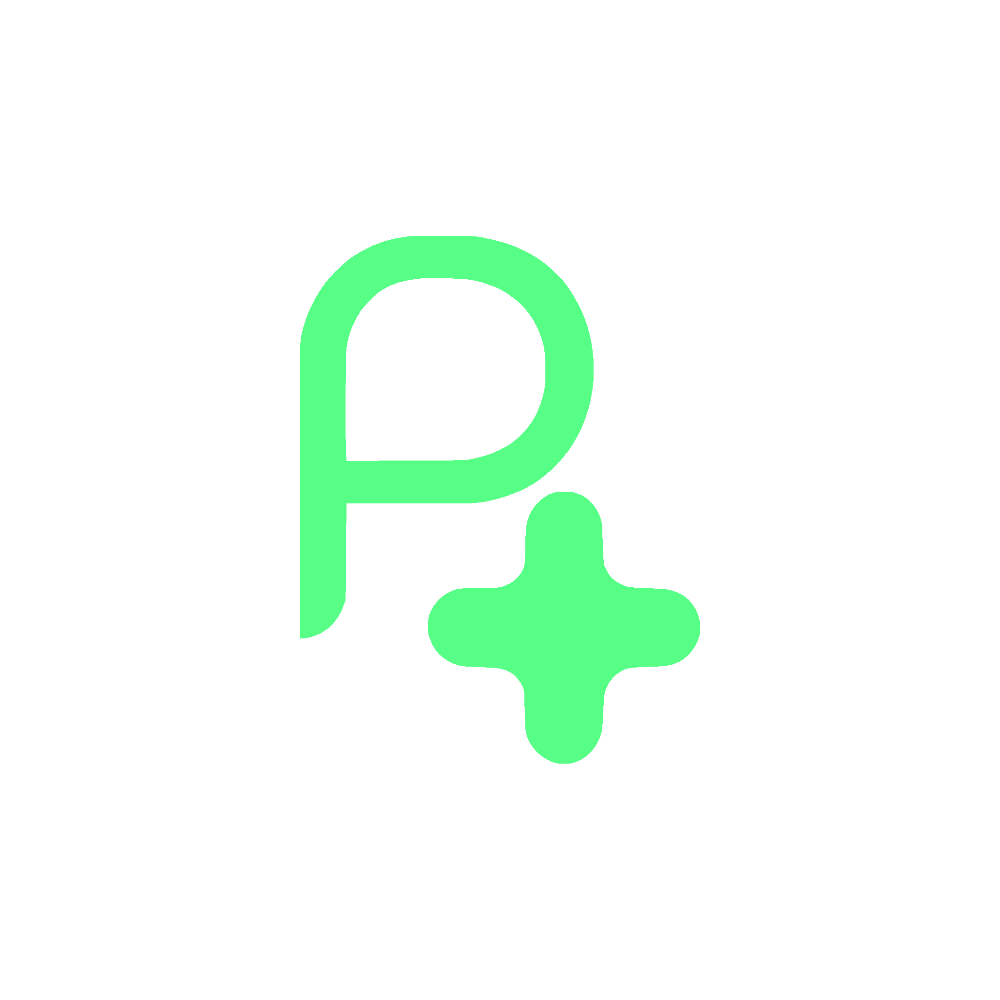

# Pulse Plus

[![Contributors][contributors-shield]][contributors-url]
[![Forks][forks-shield]][forks-url]
[![Stargazers][stars-shield]][stars-url]
[![Issues][issues-shield]][issues-url]

<!-- PROJECT LOGO -->
<br />
<div align="center">
  <a href="https://github.com/uknes/Pulse-plus">
    
  </a>

  <h3 align="center">Pulse Plus</h3>

  <p align="center">
    A comprehensive CPR training and emergency response Flutter application that provides educational content in multiple languages.
    <br />
    <a href="#documentation"><strong>Explore the docs »</strong></a>
    <br />
    <br />
    <a href="#demo">View Demo</a>
    ·
    <a href="https://github.com/uknes/Pulse-plus/issues">Report Bug</a>
    ·
    <a href="https://github.com/uknes/Pulse-plus/issues">Request Feature</a>
  </p>
</div>

<!-- TABLE OF CONTENTS -->
<details>
  <summary>Table of Contents</summary>
  <ol>
    <li><a href="#about-the-project">About The Project</a></li>
    <li><a href="#features">Features</a></li>
    <li><a href="#getting-started">Getting Started</a></li>
    <li><a href="#project-structure">Project Structure</a></li>
    <li><a href="#technologies-used">Technologies Used</a></li>
    <li><a href="#roadmap">Roadmap</a></li>
    <li><a href="#contributing">Contributing</a></li>
    <li><a href="#license">License</a></li>
    <li><a href="#contact">Contact</a></li>
    <li><a href="#acknowledgments">Acknowledgments</a></li>
  </ol>
</details>

## About The Project

<div align="center">
  
</div>

Pulse Plus is your comprehensive companion for CPR training and emergency response. Built with Flutter, it offers an intuitive interface for learning life-saving techniques through interactive content in multiple languages.

## Features

- 🎥 Video-based CPR training tutorials
- 🌍 Multi-language support (English, Arabic, French)
- 🚨 Emergency response guidelines
- 📱 Interactive user interface
- 👤 Customizable user avatars
- 🌓 Dark/Light theme support
- 🔊 Voice guidance in multiple languages

## Getting Started

### Prerequisites

- Flutter SDK (latest version)
- Android Studio / VS Code
- Git

### Installation

1. Clone the repository
```bash
git clone https://github.com/uknes/Pulse-plus.git
```

2. Navigate to project directory
```bash
cd pulse_plus
```

3. Install dependencies
```bash
flutter pub get
```

4. Run the app
```bash
flutter run
```

## Project Structure

```
lib/
├── models/         # Data models
├── providers/      # State management
├── screens/        # App screens
├── widgets/        # Reusable widgets
└── l10n/          # Localization files

assets/
├── avatars/        # User avatar images
├── fonts/          # Custom fonts
├── icons/          # App icons
├── images/         # App images
├── videos/         # Training videos
└── voices/         # Voice guidance audio
```

## Technologies Used

- Flutter
- Dart
- Provider for state management
- Video Player for tutorial playback
- Localization for multi-language support

## Roadmap

- [ ] Add more language support
- [ ] Implement offline video caching
- [ ] Add interactive quizzes
- [ ] Integrate with emergency services
- [ ] Add AR-based training modules

See the [open issues](https://github.com/uknes/Pulse-plus/issues) for a full list of proposed features and known issues.

## Contributing

Contributions are what make the open source community such an amazing place to learn, inspire, and create. Any contributions you make are **greatly appreciated**.

1. Fork the Project
2. Create your Feature Branch (`git checkout -b feature/AmazingFeature`)
3. Commit your Changes (`git commit -m 'Add some AmazingFeature'`)
4. Push to the Branch (`git push origin feature/AmazingFeature`)
5. Open a Pull Request

## Acknowledgments

* [Flutter](https://flutter.dev)
* [Font Awesome](https://fontawesome.com)
* [Choose an Open Source License](https://choosealicense.com)

## License

This is proprietary software. All rights reserved by Uknes Studio.
No license is granted for use, modification, or distribution without explicit written permission.

## Contact

- Developer: Uknes Studio
- Email: rayanmakran2@gmail.com
- GitHub: https://github.com/uknes

<!-- MARKDOWN LINKS & IMAGES -->
[contributors-shield]: https://img.shields.io/github/contributors/uknes/Pulse-plus.svg?style=for-the-badge
[contributors-url]: https://github.com/uknes/Pulse-plus/graphs/contributors
[forks-shield]: https://img.shields.io/github/forks/uknes/Pulse-plus.svg?style=for-the-badge
[forks-url]: https://github.com/uknes/Pulse-plus/network/members
[stars-shield]: https://img.shields.io/github/stars/uknes/Pulse-plus.svg?style=for-the-badge
[stars-url]: https://github.com/uknes/Pulse-plus/stargazers
[issues-shield]: https://img.shields.io/github/issues/uknes/Pulse-plus.svg?style=for-the-badge
[issues-url]: https://github.com/uknes/Pulse-plus/issues
